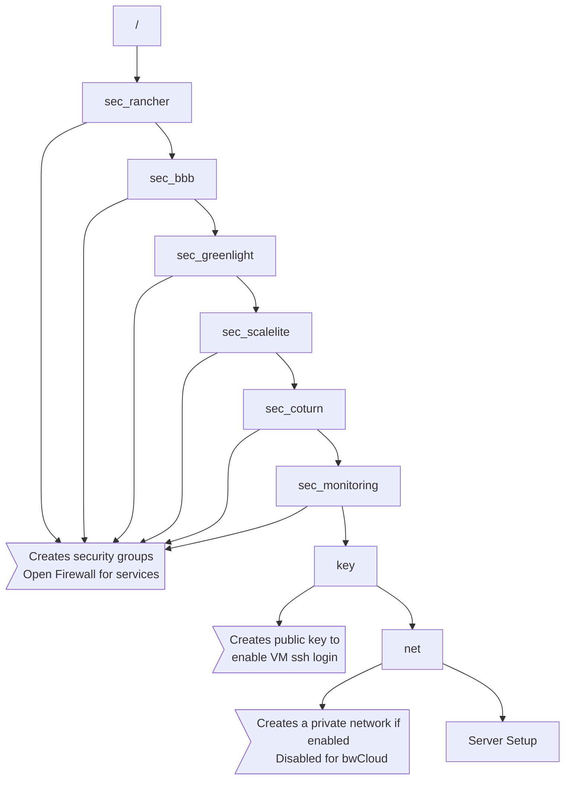
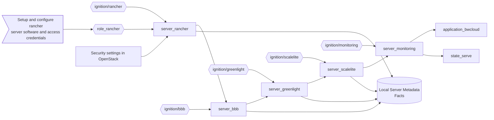
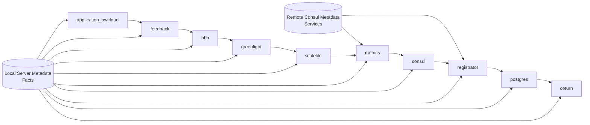
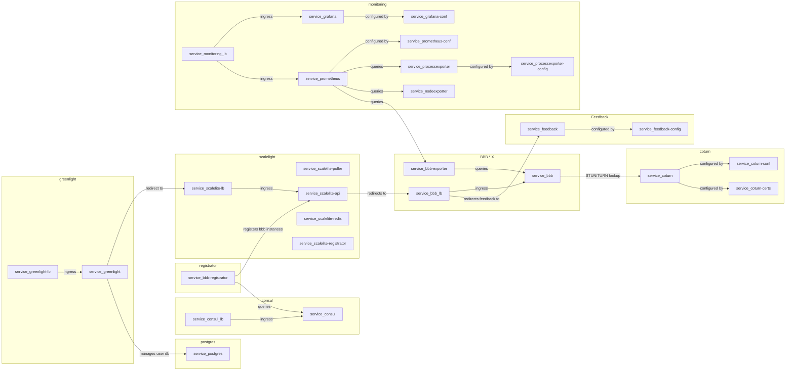

# Process

## Overview

Broadly speaking, the deployment process is divided into three parts. Everything is handled by Ansible:

1. Using an IaaS provider (in this case OpenStack) to provide the virtual infrastructure
   * See Security settings in OpenStack
   * See Server bootstrapping in OpenStack
2. Bootstrapping a container orchestrator (in this case Rancher1.6)
   * See Server bootstrapping in OpenStack -> `role_server_rancher`
3. Leveraging this container orchestrator to deploy the actual application
   * See Application bootstrapping in Rancher

## Security settings in OpenStack

Fine grained security groups for each service and server are created to only allow access to specific ports. You should supply a private and public key named `infrastructure/key` and `infrastructure/key.pub`, to upload it to OpenStack. This key (public) will be deployed to each VM using cloud-init (CoreOS ignition).

If a private network and floating IPs shall be used, it is handled by the network component.



## Server bootstrapping in OpenStack

To consequently apply the immutable infrastructure concept we make use of CoreOS and Ignition. Upon first boot, CoreOS applies configuration received from ignition to configure the operating system. This includes, files, services, network configuration, mounts and possibly more.

The rancher server is a special case, since the via ignition bootstrapped application "Rancher" has to be configured. This is done by applying the rancher role, which uses curl and the Rancher API to apply this configuration. Here the following items are configured:

* Environment
* Docker registry
* Access credentials
* Registration token

These configuration options are locally cached and should be part of version control. They are later consumed by the other servers to register to the rancher server. They are also consumed by the application deployment to access the Rancher API.



## Application bootrapping in Rancher

The application deployment simply applies all application descriptions in `infrastructure/apps`. Every application consists of a `*.yml` and a corresponding `*-rancher.yml` file. Some services are registered to consul to make use of prometheus' service discovery and to implement a custom service discovery for all bbb instances.



## Application Architecture



## Manual Steps

### Register the Rancher server in its own orchestrator

Out of convenience, the rancher Server itself is not registered within any of its environments. To do so a manual step is necessary. For example

```bash
docker run --rm --privileged -e CATTLE_HOST_LABELS='io.rancher.scheduler.require_any=io.rancher.container.system, type=admin&type=admin&name=rancher.novalocal' -e CATTLE_AGENT_IP="$IP" -v /var/run/docker.sock:/var/run/docker.sock -v /var/lib/rancher:/var/lib/rancher rancher/agent:v1.2.10 $TOKEN
```